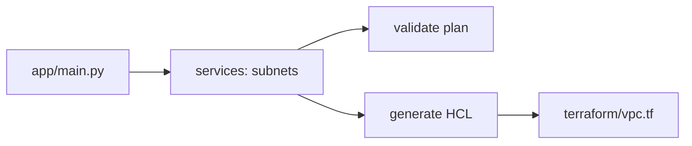

# infra-vpc-networking

[](https://github.com/Shamanchi/infra-vpc-networking/actions/workflows/ci.yml)
[](https://www.python.org/)
[](./Dockerfile)
[](./LICENSE)

> **English TL;DR:** CLI VPC planner: splits a CIDR into per-AZ public/private subnets with usable-host counts, validates plans and renders Terraform. Stdlib `ipaddress`, fully offline.

CLI-планировщик VPC: режет CIDR на публичные/приватные подсети по зонам с подсчётом usable-хостов, проверяет планы и генерирует Terraform. Только `ipaddress`, офлайн.

Источник темы: `DevOps-Projects / P-02 (project-02-aws-vpc-architecture)` — идею и постановку взяли из каталога, код и тексты написаны с нуля.

## Какую задачу решает

Проектирование VPC вручную — источник ошибок в масках и пересечениях: планировщик считает подсети, usable-хосты и привязку к зонам, а валидатор ловит пересечения и выход за VPC.

## Архитектура



Слои: CLI → `services/` → `core/`, настройки через `pydantic-settings`.

## Быстрый старт

```bash
cp .env.example .env
pip install -r requirements.txt
python -m app.main plan --cidr 10.0.0.0/16 --azs 2 --newbits 8 --out plan.json
python -m app.main validate --file plan.json
python -m app.main generate --cidr 10.0.0.0/16 --azs 2 --out terraform/generated.tf
```

Эталонный манифест — в [terraform/vpc.tf](./terraform/vpc.tf).

## CLI

- `plan --cidr CIDR --azs N --newbits B --out PATH` — посчитать подсети (public/private на зону) в JSON.
- `validate --file PATH` — проверить план JSON. Exit 0 — ок, 2 — ошибки.
- `generate --cidr CIDR --azs N --out PATH` — Terraform VPC + подсети + IGW/NAT.

## Переменные окружения (.env)

| Переменная | Назначение | По умолчанию |
|---|---|---|
| `AWS_REGION` | Регион для генерируемого HCL | `eu-central-1` |
| `OUTPUT_DIR` | Папка вывода без `--out` | `./out` |
| `APP_ENV` | Окружение | `development` |

Полный список — в [.env.example](./.env.example).

## Тесты

```bash
pip install -r requirements.txt
pytest -q
pytest -q -m integration
```

Unit-тесты без сети. Интеграционные (`-m integration`) — CLI через subprocess, тоже без сети.

## Контакты

- Telegram: @PavelYrevichh
- Email: Lietman46@mail.ru
- GitHub: Shamanchi
- FL.ru: https://www.fl.ru/users/Shamanchi
